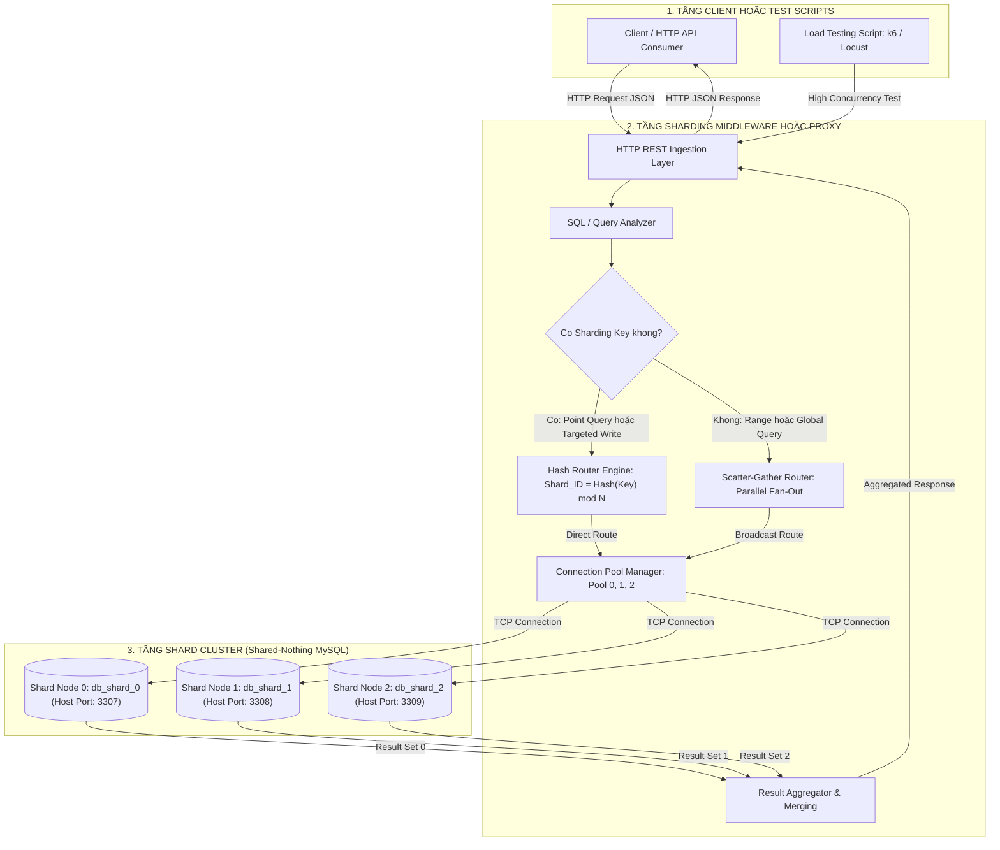

# BÁO CÁO THIẾT KẾ ĐỒ ÁN TỐT NGHIỆP: HỆ THỐNG SHARDING CƠ SỞ DỮ LIỆU

**Đề tài**: Thiết kế và hiện thực hóa hệ thống Phân mảnh cơ sở dữ liệu (Database Sharding & Horizontal Partitioning) cho ứng dụng quy mô lớn  
**Giai đoạn**: PHASE 1 - Kiến trúc hệ thống, Thiết kế CSDL và Hạ tầng

---

## 1. PHÂN TÍCH VÀ THIẾT KẾ KIẾN TRÚC TỔNG QUAN (System Architecture)

### 1.1. Bối cảnh và Động lực thiết kế

Trong các hệ thống phân tán chịu tải cao (High Concurrency & Big Data), cơ sở dữ liệu nguyên khối (Monolithic Database) nhanh chóng gặp phải các giới hạn vật lý:

- Nút thắt cổ chai về I/O đĩa cứng (Disk I/O Bottleneck).
- Giới hạn kích thước bộ nhớ đệm (Buffer Pool / RAM Limit).
- Giới hạn kết nối đồng thời tối đa (Max Concurrent Connections).

Giải pháp phân mảnh ngang (*Horizontal Sharding*) theo kiến trúc **Shared-Nothing** chia nhỏ tập dữ liệu khổng lồ thành nhiều tập con logic độc lập, phân tán trên cụm máy chủ hoặc container riêng biệt.

---

### 1.2. Mô hình kiến trúc 3 tầng (3-Tier Transparent Sharding Architecture)

Hệ thống được thiết kế theo 3 tầng chức năng độc lập:

1. **Tầng Client / Test Script (Consumer Layer)**:
   - Các ứng dụng phía khách hàng hoặc kịch bản kiểm thử tải (k6, JMeter, Python load tests).
   - Giao tiếp qua giao thức chuẩn HTTP/REST API.
   - Hoàn toàn vô nhận thức (*Location Transparency*) đối với việc lưu trữ thực tế bên dưới.
2. **Tầng Sharding Middleware / Proxy (Routing & Coordination Layer)**:
   - Đóng vai trò làm bộ não điều phối trung tâm.
   - Tiếp nhận truy vấn, bóc tách cấu trúc cú pháp (SQL/AST Parsing).
   - Trích xuất khóa phân mảnh (*Sharding Key*), áp dụng thuật toán băm (Hash Algorithm) để xác định shard đích.
   - Quản lý các Connection Pool riêng biệt tới từng shard vật lý.
   - Tổng hợp kết quả (*Result Merging / Scatter-Gather*) khi truy vấn trải rộng qua nhiều shard.
3. **Tầng Shard Cluster (Distributed Data Layer)**:
   - Gồm N node cơ sở dữ liệu độc lập (trong đồ án: 3 container MySQL 8.0: `db_shard_0`, `db_shard_1`, `db_shard_2`).
   - Kiến trúc Shared-Nothing: Mỗi shard sở hữu CPU, RAM và Persistent Volume riêng biệt.

---

### 1.3. Sơ đồ kiến trúc luồng dữ liệu (Mermaid Diagram)



---

## 2. CHIẾN LƯỢC ĐỊNH TUYẾN DỮ LIỆU (Routing & Sharding Strategy)

### 2.1. Chiến lược phân mảnh: Hash-based Horizontal Sharding

Hệ thống sử dụng kỹ thuật phân mảnh ngang dựa trên hàm băm (Hash-based Sharding). Dữ liệu được phân phối giả ngẫu nhiên nhưng có tính tất định (*deterministic*), giúp xóa bỏ hiện tượng điểm nóng (*Write Hotspots*) thường gặp ở Range-based Sharding khi sử dụng ID tự tăng.

### 2.2. Công thức toán học định tuyến

$$ShardIndex = \mathcal{H}(ShardingKey) \pmod N$$

Trong đó:
- $ShardingKey$: Khóa phân mảnh được chọn (`user_id`).
- $\mathcal{H}(k)$: Hàm băm (CRC32, MurmurHash3 hoặc MD5/SHA256 mod int).
- $N$: Tổng số lượng node Shard ($N = 3$).
- $ShardIndex \in \{0, 1, 2\}$: Chỉ số xác định node Shard vật lý chịu trách nhiệm.

Cụ thể với thuật toán CRC32:

$$ShardIndex = \text{CRC32}(UserId) \pmod 3$$

### 2.3. Đánh giá ưu điểm và nhược điểm

| Tiêu chí | Ưu điểm (Pros) | Nhược điểm (Cons) | Giải pháp khắc phục |
| :--- | :--- | :--- | :--- |
| **Phân phối tải** | Dữ liệu và I/O được dàn đều trên toàn bộ các shard, tránh thắt cổ chai ở 1 nút. | Có thể xuất hiện độ lệch dữ liệu nếu một số key có lượng truy cập đột biến (Heavy Hitters). | Sử dụng hàm băm chất lượng cao, giám sát phân bố key. |
| **Thời gian tính toán** | Độ phức tạp thuật toán là $O(1)$, thực thi cực nhanh trên CPU Middleware. | Thay đổi số lượng $N$ Shard đòi hỏi phải di chuyển dữ liệu (Rehashing). | Áp dụng Consistent Hashing (Consistent Hash Ring) cho giai đoạn mở rộng. |
| **Hiệu năng truy vấn** | Truy vấn có chứa Sharding Key chỉ tác động lên đúng 1 shard mục tiêu. | Truy vấn phạm vi không có Sharding Key phải scatter-gather đến toàn bộ Shards. | Khuyến khích truyền Sharding Key trong mọi API, tạo Global Secondary Index nếu cần. |

---

## 3. THIẾT KẾ CƠ SỞ DỮ LIỆU VÀ LƯỢC ĐỒ DỮ LIỆU (Database Schema Design)

### 3.1. Lựa chọn Sharding Key

- **Trường được chọn**: `user_id`.
- **Lý do**:
  1. **Lực lượng (Cardinality) cao**: Phân tán đều, không gom nhóm.
  2. **Tần suất nghiệp vụ**: Đại đa số các truy vấn xem đơn hàng, thông tin cá nhân đều gắn liền với người dùng cụ thể.
  3. **Colocated Data (Đồng vị trí)**: Bảng `orders` cũng dùng `user_id` làm sharding key phụ, cho phép thực hiện phép `JOIN` giữa `users` và `orders` ngay trên cùng một node shard cục bộ mà không phát sinh Cross-shard JOIN.

### 3.2. Cấu trúc bảng mẫu trên từng Shard

```sql
CREATE DATABASE IF NOT EXISTS `ecommerce_db` 
CHARACTER SET utf8mb4 COLLATE utf8mb4_unicode_ci;

USE `ecommerce_db`;

-- 1. BẢNG USERS (Sharding Key: id)
DROP TABLE IF EXISTS `users`;
CREATE TABLE `users` (
    `id` BIGINT UNSIGNED NOT NULL COMMENT 'Sharding Key: ID người dùng',
    `username` VARCHAR(64) NOT NULL,
    `email` VARCHAR(128) NOT NULL,
    `password_hash` VARCHAR(255) NOT NULL,
    `full_name` VARCHAR(100),
    `created_at` TIMESTAMP DEFAULT CURRENT_TIMESTAMP,
    `updated_at` TIMESTAMP DEFAULT CURRENT_TIMESTAMP ON UPDATE CURRENT_TIMESTAMP,
    PRIMARY KEY (`id`),
    UNIQUE KEY `uk_email` (`email`)
) ENGINE=InnoDB DEFAULT CHARSET=utf8mb4 COLLATE=utf8mb4_unicode_ci;

-- 2. BẢNG ORDERS (Sharding Key: user_id)
DROP TABLE IF EXISTS `orders`;
CREATE TABLE `orders` (
    `id` BIGINT UNSIGNED NOT NULL AUTO_INCREMENT,
    `user_id` BIGINT UNSIGNED NOT NULL COMMENT 'Sharding Key: Đồng vị trí với users.id',
    `order_code` VARCHAR(64) NOT NULL,
    `total_amount` DECIMAL(15, 2) NOT NULL DEFAULT 0.00,
    `status` ENUM('PENDING', 'PAID', 'SHIPPED', 'CANCELLED') NOT NULL DEFAULT 'PENDING',
    `shipping_address` TEXT NOT NULL,
    `created_at` TIMESTAMP DEFAULT CURRENT_TIMESTAMP,
    `updated_at` TIMESTAMP DEFAULT CURRENT_TIMESTAMP ON UPDATE CURRENT_TIMESTAMP,
    PRIMARY KEY (`id`, `user_id`),
    INDEX `idx_user_created` (`user_id`, `created_at`),
    INDEX `idx_order_code` (`order_code`)
) ENGINE=InnoDB DEFAULT CHARSET=utf8mb4 COLLATE=utf8mb4_unicode_ci;
```

---

## 4. CẤU HÌNH HẠ TẦNG VÀ THỰC THI (Infrastructure Deployment)

- Xem chi tiết file [docker-compose.yml](file:///d:/ChuyenDeKyThuatPhanMem/docker-compose.yml) để khởi chạy cụm 3 Shard MySQL 8.0.
- Khởi tạo schema tự động bằng thư mục `init-scripts/` gắn vào volume `docker-entrypoint-initdb.d`.
