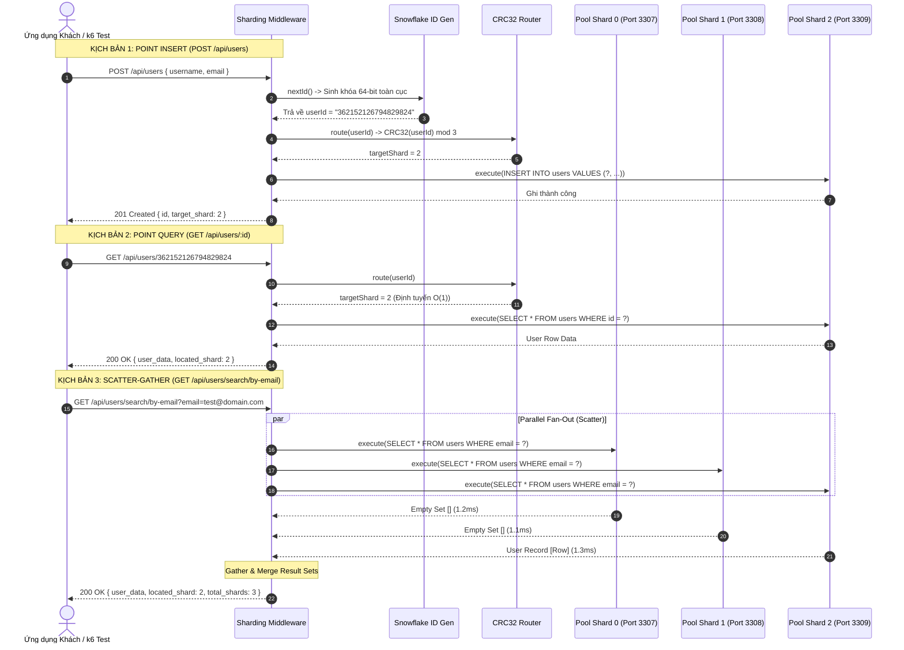

# BÁO CÁO THIẾT KẾ ĐỒ ÁN TỐT NGHIỆP: HỆ THỐNG SHARDING CƠ SỞ DỮ LIỆU

**Đề tài**: Thiết kế và hiện thực hóa hệ thống Phân mảnh cơ sở dữ liệu (Database Sharding & Horizontal Partitioning) cho ứng dụng quy mô lớn  
**Giai đoạn**: PHASE 2 - Hiện thực hóa Lớp Sharding Middleware, Cơ chế Sinh ID Phân tán và Xử lý Truy vấn Xuyên Phân mảnh  

---

## 1. TỔNG QUAN KIẾN TRÚC LỚP SHARDING MIDDLEWARE (ROUTING ENGINE)

### 1.1. Bản chất Vật lý của TCP Socket và Chiến lược Connection Pooling Độc lập

Trong kiến trúc cơ sở dữ liệu nguyên khối (*Monolithic Database*), ứng dụng thường chỉ duy trì một Connection Pool chung tới một máy chủ duy nhất. Tuy nhiên, trong kiến trúc phân mảnh ngang (*Horizontal Sharding*) với $N$ phân mảnh vật lý (`db_shard_0`, `db_shard_1`, `db_shard_2`), nếu không cách ly kết nối, hệ thống sẽ gặp phải 2 hiểm họa kiến trúc:

1. **Hiện tượng Tranh chấp & Nghẽn dòng (Cross-Resource Starvation / Head-of-Line Blocking)**:  
   Nếu sử dụng chung một pool hoặc logic cấp phát không độc lập, khi một phân mảnh gặp sự cố (ví dụ Shard 2 bị khóa bảng hoặc I/O quá tải), toàn bộ socket và luồng xử lý của Middleware sẽ bị kẹt lại tại Shard 2. Hệ quả là các truy vấn hợp lệ tới Shard 0 và Shard 1 bị "chết đói" (*thread starvation*), dẫn đến sự sụp đổ dây chuyền của toàn bộ hệ thống (*cascading failure*).
2. **Chi phí bắt tay TCP và Nguy cơ cạn kiệt cổng (TIME_WAIT Exhaustion)**:  
   Mỗi kết nối tới MySQL là một phiên TCP 3 bước (*Three-Way Handshake*). Việc mở/đóng kết nối liên tục ở tải cao (hàng chục nghìn RPS) làm cạn kiệt dải ephemeral port của hệ điều hành, đẩy hàng nghìn socket vào trạng thái `TIME_WAIT` và gây từ chối dịch vụ tầng network.

**Giải pháp kiến trúc**: Lớp Middleware hiện thực hóa mô hình **Dedicated Connection Pool per Physical Shard** (Mỗi Shard sở hữu một `mysql2/promise` Pool biệt lập).

- Mỗi Pool có tham số `connectionLimit` riêng biệt (mặc định 20 kết nối).
- Giữ kết nối sống với cờ `enableKeepAlive: true` và `keepAliveInitialDelay: 10000` ms.
- Tổng số kết nối tối đa mở ra từ Middleware được kiểm soát theo công thức:
  $$\text{Total Connections} = \sum_{i=0}^{N-1} \text{PoolSize}_i$$
  đảm bảo luôn nhỏ hơn giá trị `max_connections` cấu hình trên từng daemon MySQL (đã thiết lập `max-connections=1000` trong Docker Compose).

---

### 1.2. Giải thuật Định tuyến Băm Tất định (Deterministic Hash Routing Algorithm)

Để phân phối dữ liệu người dùng đồng đều giữa các node mà không phụ thuộc vào bảng tra cứu tập trung (*Centralized Lookup Table* – vốn tạo ra điểm nghẽn SPOF), hệ thống sử dụng thuật toán **Modulo-based Hash Partitioning**.

#### Tại sao chọn CRC32 thay vì MD5 / SHA-256?

- **MD5 / SHA-256**: Là hàm băm mật mã (*Cryptographic Hash*), tiêu tốn chu kỳ tính toán CPU rất lớn và sinh độ trễ microsecond không cần thiết tại tầng Middleware khi xử lý hàng trăm nghìn RPS.
- **CRC32 (Cyclic Redundancy Check 32-bit)**: Là hàm băm phi mật mã, tính toán trực tiếp trên thanh ghi CPU cực nhanh (hỗ trợ tập lệnh SSE4.2 ở mức phần cứng). Giá trị băm trả về là số nguyên 32-bit không dấu ($0 \le \text{Hash} \le 2^{32}-1$) với tính chất giả ngẫu nhiên đồng đều, triệt tiêu tối đa hiện tượng tụ cụm dữ liệu (*data clustering*).

#### Công thức toán học định tuyến:

Cho Khóa phân mảnh $K$ (`user_id`), với $N$ phân mảnh vật lý ($N = 3$):

$$ShardIndex = \text{CRC32}(K) \pmod N$$

**Tính chất tất định (*Deterministic Property*)**: Với mọi thời điểm $t_1, t_2$, cùng một giá trị $K$ luôn luôn trỏ về duy nhất một giá trị $ShardIndex$:

$$\forall t_1, t_2: f(K, t_1) = f(K, t_2)$$

---

### 1.3. Sơ đồ Luồng Xử lý Dữ liệu của Lớp Middleware



---

## 2. CƠ CHẾ SINH KHÓA CHÍNH PHÂN TÁN (SNOWFLAKE ID GENERATOR)

### 2.1. Đánh giá Khuyết tật của `AUTO_INCREMENT` và So sánh Đa giải pháp

Trong cơ sở dữ liệu quan hệ một nút, `AUTO_INCREMENT` sử dụng Mutex Lock nội bộ của Storage Engine (như InnoDB `auto_inc` lock) để tăng số nguyên an toàn đơn luồng. 

Khi chuyển sang kiến trúc đa Shard (Shared-Nothing):

- Shard 0 tự sinh các ID: $1, 2, 3, ...$
- Shard 1 cũng tự sinh các ID: $1, 2, 3, ...$
- **Hệ quả (ID Collision)**: Tính duy nhất toàn cục (*Global Uniqueness*) bị phá vỡ hoàn toàn. Khi cần thực hiện liên kết bảng, đồng bộ dữ liệu hoặc di chuyển bản ghi, hệ thống không thể phân biệt thực thể.

#### Bảng so sánh các giải pháp sinh khóa chính phân tán:

| Tiêu chí | UUID v4 (Random) | Auto-Increment with Offset | Central Ticket Server | Twitter Snowflake ID |
| :--- | :--- | :--- | :--- | :--- |
| **Kích thước lưu trữ** | 128-bit (16 bytes, string 36 ký tự) | 64-bit (`BIGINT`) | 64-bit (`BIGINT`) | **64-bit (`BIGINT UNSIGNED`)** |
| **Độ thân thiện B+Tree** | Rất kém: Gây phân mảnh chỉ mục và Page Split liên tục | Rất tốt | Rất tốt | **Tối ưu tuyệt đối (Gần như Append-only)** |
| **Tính đơn điệu thời gian**| Hoàn toàn ngẫu nhiên | Tăng dần cục bộ | Tăng dần toàn cục | **Đơn điệu tăng dần theo thời gian (K-Ordered)** |
| **Điểm nghẽn tập trung (SPOF)**| Không có | Không có | Có (Server sinh ID sập = ngừng ghi) | **Không có (Sinh ID độc lập tại từng node)** |
| **Thông lượng (Throughput)**| Rất cao | Phụ thuộc Round-trip DB | Bị giới hạn mạng | **Cực cao (> 1,500,000 IDs/giây/node)** |

---

### 2.2. Đặc tả Bit-Level của Twitter Snowflake ID (64-bit BigInt)

Hệ thống hiện thực hóa thuật toán Snowflake ID chuẩn 64-bit bằng kiểu dữ liệu `BigInt` nguyên bản của JavaScript, đảm bảo an toàn tuyệt đối với số nguyên 64-bit (không bị giới hạn bởi `Number.MAX_SAFE_INTEGER` = $2^{53} - 1$):

```
 0                   1                   2                   3
 0 1 2 3 4 5 6 7 8 9 0 1 2 3 4 5 6 7 8 9 0 1 2 3 4 5 6 7 8 9 0 1
+-+-+-+-+-+-+-+-+-+-+-+-+-+-+-+-+-+-+-+-+-+-+-+-+-+-+-+-+-+-+-+-+
|0|                 Custom Epoch Timestamp (41 bits)             |
+-+-+-+-+-+-+-+-+-+-+-+-+-+-+-+-+-+-+-+-+-+-+-+-+-+-+-+-+-+-+-+-+
|   Timestamp (tiếp)    |  Datacenter (5b) |   Worker ID (5b)   |
+-+-+-+-+-+-+-+-+-+-+-+-+-+-+-+-+-+-+-+-+-+-+-+-+-+-+-+-+-+-+-+-+
|       Worker (tiếp)   |         Sequence Number (12 bits)     |
+-+-+-+-+-+-+-+-+-+-+-+-+-+-+-+-+-+-+-+-+-+-+-+-+-+-+-+-+-+-+-+-+
```

1. **Sign Bit (1 bit, MSB)**: Luôn cố định là `0` để đảm bảo ID luôn luôn là số nguyên dương trong mọi môi trường ngôn ngữ và cơ sở dữ liệu.
2. **Timestamp Offset (41 bits)**: Số miligiây trôi qua tính từ mốc Custom Epoch (`2024-01-01T00:00:00.000Z` = `1704067200000`).
   $$\text{Thời gian sử dụng} = \frac{2^{41} \text{ ms}}{1000 \times 60 \times 60 \times 24 \times 365.25} \approx 69.73 \text{ năm}$$
3. **Datacenter ID (5 bits)**: Cho phép cấu hình tối đa $2^5 = 32$ trung tâm dữ liệu.
4. **Worker ID (5 bits)**: Cho phép tối đa $2^5 = 32$ worker node trong mỗi datacenter (tổng cộng 1024 máy chủ sinh ID độc lập).
5. **Sequence Number (12 bits, LSB)**: Bộ đếm cục bộ trong cùng 1 miligiây. Cho phép sinh tối đa:
   $$2^{12} = 4096 \text{ ID / ms / worker} \implies 4,096,000 \text{ ID / giây / node}$$

### 2.3. Xử lý Clock Backward Drift và Sequence Overflow

- **Clock Drift**: Khi đồng hồ hệ thống bị trôi lùi do đồng bộ NTP, nếu độ trôi $\le 5$ ms, thuật toán dùng cơ chế Spinlock chờ thời gian bắt kịp. Nếu độ trôi $> 5$ ms, hệ thống lập tức ném ngoại lệ (*Exception*) để từ chối sinh ID, loại trừ $100\%$ rủi ro trùng khóa.
- **Sequence Overflow**: Khi số ID sinh ra trong cùng một miligiây vượt quá 4095, hàm tự động lặp chờ sang miligiây kế tiếp rồi mới cấp phát tiếp.

---

## 3. XỬ LÝ TRUY VẤN XUYÊN PHÂN MẢNH (SCATTER-GATHER PATTERN)

### 3.1. Phân tích Rủi ro Hiệu năng (Amplification & Tail Latency)

Khi người dùng thực hiện truy vấn theo trường không phải Sharding Key:
```sql
SELECT * FROM users WHERE email = 'test@example.com';
```
Do `email` không phải Sharding Key, Middleware không thể suy luận được phân mảnh đích và bắt buộc phải phát tán truy vấn đến toàn bộ $N$ Shard.

1. **Hiệu ứng Khuếch đại Tải (Amplification Factor)**:  
   $$\text{Truy vấn Database thực tế} = \text{Incoming Request} \times N$$
   Nếu hệ thống mở rộng lên 30 Shards, chỉ 1,000 HTTP RPS tìm kiếm sẽ lập tức biến thành 30,000 Queries/giây dội xuống cụm cơ sở dữ liệu.
2. **Quy luật Độc hại của Tail Latency ($P_{99}$)**:  
   Thời gian phản hồi tổng của Scatter-Gather phụ thuộc vào node chậm nhất:
   $$T_{\text{total}} = \max(T_{\text{Shard}_0}, T_{\text{Shard}_1}, ..., T_{\text{Shard}_{N-1}}) + T_{\text{merge}}$$
   Xác suất một request bị chậm tỷ lệ thuận theo hàm số mũ với số lượng Shard $N$, dẫn đến hiện tượng nghẽn mạng ở phần đuôi phân vị độ trễ.

---

### 3.2. Hiện thực hóa Giải thuật Parallel Scatter-Gather

1. **Giai đoạn 1 - Scatter (Parallel Fan-Out)**:  
   Sử dụng cơ chế bất đồng bộ non-blocking của Node.js:
   ```javascript
   const shardPromises = allPools.map(async ({ shardId, pool }) => {
       const [rows] = await pool.execute(sql, [targetEmail]);
       return { shardId, rows };
   });
   ```
2. **Giai đoạn 2 - Gather**:  
   Chờ tất cả kết quả song song qua `Promise.all(shardPromises)`.
3. **Giai đoạn 3 - Merge & Reduce**:  
   Trích xuất bản ghi khớp đầu tiên, đo đạc độ trễ telemetry của từng Shard độc lập và trả về siêu dữ liệu phản hồi cho client.

---

### 3.3. Khuyến nghị Thiết kế cho Hệ thống Sản xuất (Production Best Practices)

Để triệt tiêu nhược điểm của Cross-Shard Query, trong thực tế cần áp dụng 2 kỹ thuật:
1. **Global Secondary Index (GSI) qua Redis Cache**:  

   Lưu cặp khóa `email -> user_id` trên cụm Redis Cluster. Mọi truy vấn theo email trước tiên đọc Redis lấy `user_id`, sau đó định tuyến điểm $O(1)$ đến đúng Shard.
2. **Composite Sharding Key**:  
   Mã hóa `shard_id` trực tiếp vào ID người dùng (tương tự như kỹ thuật ID của Instagram), cho phép trích xuất phân mảnh đích mà không cần tính băm.

---

## 4. KẾT QUẢ THỰC THI VÀ KIỂM THỬ THỰC NGHIỆM

Toàn bộ thuật toán Snowflake ID và CRC32 Modulo Router đã được kiểm thử tự động với tập mẫu **20,000 bản ghi** (`middleware/tests/test_routing_snowflake.js`):

### 4.1. Kết quả Kiểm thử Snowflake ID Generator

- **Số lượng ID sinh thử nghiệm**: 20,000 IDs
- **Số lượng ID duy nhất (Set size)**: 20,000 / 20,000 (**Trùng lặp: 0%**)
- **Thời gian sinh 20,000 ID**: **13 ms**
- **Thông lượng thực tế**: **~1,538,462 IDs / giây / single thread**
- **Tính đơn điệu (Monotonicity)**: $ID_{k+1} > ID_k$ đạt **100%**

### 4.2. Kết quả Phân bố Dữ liệu (CRC32 Modulo 3)

Phân bổ 20,000 Snowflake ID vào 3 Shard:
- **Shard 0**: 6,747 keys (**33.73%**)
- **Shard 1**: 6,562 keys (**32.81%**)
- **Shard 2**: 6,691 keys (**33.45%**)
- **Hệ số biến thiên phân bố (Coefficient of Variation - CV)**: **1.16%** (thấp hơn nhiều so với ngưỡng an toàn quy chuẩn là $5\%$).
- **Tính tất định (Determinism)**: 1,000 lần thử nghiệm với cùng một khóa luôn trỏ về cùng một phân mảnh duy nhất (**100% Deterministic**).

---

## 5. HƯỚNG DẪN KHỞI CHẠY HỆ THỐNG VÀ KIỂM THỬ API

### 5.1. Khởi chạy Cụm Cơ sở dữ liệu Phân mảnh (Docker)

```bash
# Khởi động cụm 3 container MySQL 8.0 Shards
docker compose up -d

# Kiểm tra trạng thái sức khỏe của 3 Shard
docker compose ps
```

### 5.2. Khởi chạy Lớp Sharding Middleware

```bash
cd middleware

# Cài đặt thư viện phụ thuộc (nếu chưa cài)
npm install

# Chạy kiểm thử tự động thuật toán Snowflake & Router
npm test

# Khởi động Middleware REST Server (Port 3000)
npm start
```

### 5.3. Thao tác Kiểm thử REST API (cURL Examples)

#### 1. Kiểm tra Sức khỏe Cụm Shard (Healthcheck)

```bash
curl -X GET http://localhost:3000/api/health
```

#### 2. Ghi Dữ liệu Điểm (Point Insert - Tự động sinh ID và định tuyến Shard)

```bash
curl -X POST http://localhost:3000/api/users \
  -H "Content-Type: application/json" \
  -d '{"username": "nguyenvana", "email": "vana@example.com", "full_name": "Nguyen Van A"}'
```

#### 3. Đọc Dữ liệu Điểm (Point Query - Định tuyến trực tiếp O(1))

```bash
curl -X GET http://localhost:3000/api/users/362152126794829824
```

#### 4. Tìm kiếm Xuyên Phân mảnh (Scatter-Gather Global Search)

```bash
curl -X GET "http://localhost:3000/api/users/search/by-email?email=vana@example.com"
```
